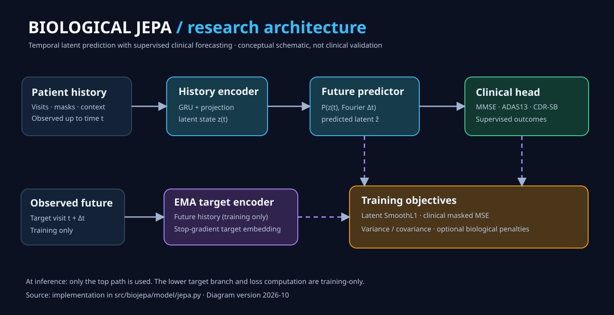
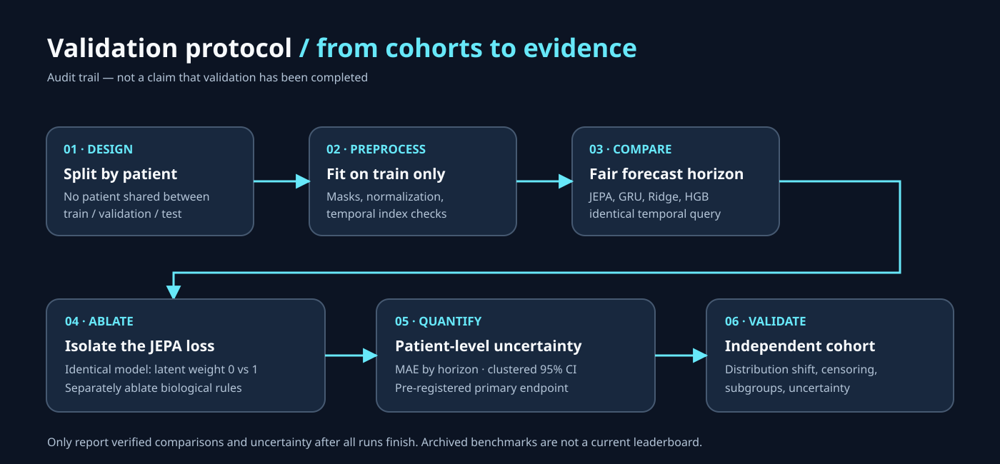

# Biological JEPA

**A research prototype for forecasting longitudinal Alzheimer's disease measurements through future latent representations.**

> **Research status — October 2026:** Code and exploratory results are available. This is **not** a clinically validated system. Historical baseline numbers require rerunning after the October 2026 GRU forecast-horizon correction. No new benchmark result is claimed in this release.

## Why this project exists

Clinical records contain irregular follow-up visits, missing measurements, and uncertain trajectories. This project tests one precise hypothesis: **does a learned future-patient representation improve longitudinal clinical prediction beyond a matched, supervised model without a latent objective?**

The project combines a temporal context encoder, a forecast-horizon-conditioned latent predictor, an EMA target encoder used during training, a clinical regression head and optional soft biomedical constraints. These rules express assumptions; they do **not** establish causal disease mechanisms.

## Architecture



**During training:** the history encoder summarizes visits up to time t. The latent predictor forecasts a future embedding, trained against a no-gradient EMA target from observed future history. A clinical head predicts future MMSE / ADAS13 / CDR-SB, with optionally penalized violations of programmed constraints.

**During inference:** only observed patient history, forecast horizon, encoder, predictor and clinical head are used. Future observations and the target encoder are not required.

[Editable architecture SVG](docs/architecture.svg) · [Implementation](src/biojepa/model/jepa.py) · [Biological rule specification](docs/BIOLOGICAL_RULES.md)

## Evidence, clearly separated

| Status | What it means |
|---|---|
| Implemented | History-aware JEPA-inspired architecture, supervised clinical head, biological penalties and baselines |
| Tested in code | Synthetic rule-engine checks and automated unit/smoke tests |
| Historical only | ADNI-derived and OASIS-2 aggregate results produced **before** the GRU comparison correction |
| Still required | Fair baseline reruns, latent-loss ablation across independent patient splits, patient-level confidence intervals and external validation |

The archived numbers in [RESULTS.md](docs/RESULTS.md) remain available for traceability. **They must not be cited as evidence that this model outperforms a correctly time-conditioned GRU.** Original code and stored artifact lineage should accompany any formal reproduction.

## Evaluation protocol



A fair test needs: disjoint patient splits, transformations fit only to training patients, matched horizon-conditioned baselines, controlled ablations, uncertainty at patient level and an independent external cohort.

[Full research protocol](docs/RESEARCH_PROTOCOL.md) · [Editable validation graphic](docs/validation_protocol.svg)

## Reproduce the research pipeline

Requires Python 3.10+ and project dependencies. Datasets are not included.

```bash
git clone https://github.com/0ans/biological-jepa.git
cd biological-jepa
make setup
make test
```

Run the *exploratory*, same-architecture latent-loss ablation on synthetic data:

```bash
./.venv/bin/python scripts/latent_ablation.py --study synthetic --seed 0
```

The script compares the same v2 architecture with latent loss coefficient 0 versus 1. **One split is not confirmatory evidence.** The full evaluation requires repeated patient-disjoint experiments with appropriately paired uncertainty estimates.

To run full dataset benchmarks, first review [ADNI access](docs/ADNI_ACCESS.md), verify permissions and local inputs, then use `make data` and `make experiments`. Training runtime depends on compute environment.

### Repeated controlled experiment

Run `python scripts/repeated_ablation.py --study synthetic --seeds 0 1 --folds 3 --epochs 50` for an exploratory patient-disjoint repeated comparison; after it finishes, `python scripts/plot_ablation.py` plots the **computed** patient-bootstrap intervals. For authorized real-data runs, see [the controlled ablation protocol](docs/CONTROLLED_ABLATION.md). Per-patient outputs are gitignored and must not be published without permission.

## Publication materials

- [Research manuscript draft](paper/MANUSCRIPT.md) — structured background, methods, limitations and explicit reporting status
- [Scientific submission checklist](paper/SUBMISSION_CHECKLIST.md) — remaining experiments, statistical validation and review requirements
- [Research protocol](docs/RESEARCH_PROTOCOL.md) — comparability, evaluation design and interpretation
- [Archived results](docs/RESULTS.md) — historical results, not new evidence
- [Research log](docs/RESEARCH_LOG.md) — design decisions and failed attempts
- [Experiment artifacts](experiments/README.md) — provenance of stored run outputs

## Repository guide

```text
src/biojepa/          model, data processing, objectives, evaluation, baselines
scripts/              data loading, patient inference, latent-loss ablation
tests/                unit, fairness and smoke tests
docs/                 transparent protocols, scientific context, SVG figures
experiments/          historical aggregate results and plots
paper/                manuscript draft and submission quality gates
.github/workflows/    automated test checks
```

## Research and clinical limitations

Available ADNI-derived data have restricted longitudinal biomarker coverage, and OASIS-2 is relatively small. Irregular visits and missingness may not be random. Conversion analyses require careful event-time and censoring handling. A low score on **coded** biological rules is not validation of causal biology. This software is not intended for patient care, diagnosis, or treatment decisions.

## Attribution

Cite as research software pending a verified manuscript. Model inspiration includes I-JEPA and VICReg; datasets include ADNI and OASIS-2. Verify bibliographic details and data-use agreements before submission.

## License

MIT — [LICENSE](LICENSE).
