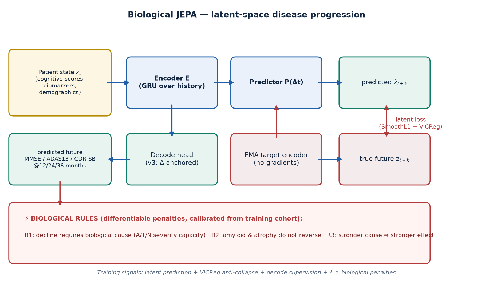

# biological-jepa

> **Research status (October 2026):** Experimental JEPA-style supervised temporal
> forecasting; this is not a clinically validated or causal disease model.
> The original supervised GRU baseline did **not** receive the requested
> prediction horizon. This has now been corrected in code, including rollout.
> **Previously published GRU comparison metrics are historical and must be
> regenerated before citing any superiority claim.** See
> [research evaluation protocol](docs/RESEARCH_PROTOCOL.md).


**Longitudinal disease progression prediction with a JEPA-inspired latent predictor
and optional biological regularization.**

This research prototype tests whether predicting a learned *future patient
representation*, alongside supervised clinical forecasting, improves
out-of-patient predictions. Soft biomedical penalties encode assumptions, not
proof of biological mechanisms or causal reasoning.

Evaluated on **real longitudinal data**: an ADNI sample (2,347 participants,
~9,300 training trajectories, baseline amyloid/tau/hippocampal markers,
longitudinal MMSE/ADAS13/CDR-SB, conversion labels) and OASIS-2
(150 subjects, 373 visits), with a synthetic Alzheimer cascade used as
ground truth for rule verification.

## The idea in one figure



**Hypothesis:** latent prediction may reduce sensitivity to noise and
missingness. This requires a controlled ablation against an identical model
without the latent objective. Lower biological-rule violations indicate
agreement with the programmed constraints, not demonstrated causality.

## Historical results (ADNI, 5-fold subject-level CV × 3 seeds; GRU rerun pending)

| | JEPA-v2 | **JEPA-v2+Bio** | GRU | HGB | Ridge | Carry-fwd |
|---|---|---|---|---|---|---|
| MMSE MAE @12 mo ↓ | 1.530 | **1.517** (λ2: 1.518) | 1.577 | 1.545 | 1.599 | 1.696 |
| CDR-SB MAE @36 mo ↓ | 1.222 | 1.196 (λ2: 1.206) | **1.201** | 1.202 | 1.298 | 1.408 |
| bio-penalty ablation (patient-level permutation) | — | **ADAS13 p=0.0025 ✓ (survives Bonferroni)** · CDRSB p=0.0001 ✓ · MMSE p=0.34 | | | | |
| MAE at 75% input degradation ↓ | 3.99 | 4.08 | **3.98** | 4.43 | 4.12 | — |

**Conversion AUC — two different measurements, never mixed:**
- 15-run CV aggregate (mixed follow-up windows): JEPA+Bio 0.683 — Ridge
  leads this metric (0.725).
- Single held-out fold, prospective design (baseline input, fixed 36-month
  window, time-under-risk labels, n=141): JEPA+Bio λ2 **0.952** vs GRU 0.927
  vs HGB 0.935 — a hard-test result, NOT a CV aggregate.

Three honest statements:

1. **The biological constraints help on 2 of 3 clinical scales** (ADAS13 and
   CDR-SB survive full Bonferroni correction at the patient level; MMSE does
   not — the earlier pair-level p=0.0002 was inflated and is superseded).
2. **Robustness to missing data is the structural win**: at 25-50% input
   degradation the JEPA family is the most accurate of all models (JEPA+Bio
   within ~1% of its unconstrained ablation), and its relative degradation at
   75% (+85%) is far below HGB's (+96%); GRU is the closest competitor (+75%)
   with worse absolute error.
3. **Honest losses**: HGB keeps CDR-SB (best at 24 mo, significantly better
   pooled); Ridge keeps conversion AUC.

Full tables, significance details, and limitations:
**[docs/RESULTS.md](docs/RESULTS.md)**.

The rule engine is verified for **implementation consistency** against a
synthetic Alzheimer cascade with known ground truth (**11/11 tests**,
including two regression tests added after external review: rules constrain
the *prediction* — not gated by future ground truth — and R3 operates on
*unique patients* with observed cells only). Compliant trajectories incur
≈ 0 penalty; unsupported decline, pathology reversal, and anti-causal
ordering are flagged with >10× margin. These tests validate the code
against its own pre-specified rules; they do not validate the rules as
clinical causal truth.
See **[docs/BIOLOGICAL_RULES.md](docs/BIOLOGICAL_RULES.md)**.

## Quickstart

```bash
git clone https://github.com/0ans/biological-jepa.git && cd biological-jepa
make setup          # venv + torch/pandas/sklearn
make data           # downloads & verifies both real datasets (checksums printed)
make test           # 11 unit tests incl. rule-engine vs ground truth
make experiments    # 8 models × 15 runs × 2 studies + hard tests (~45 min on a laptop)
```

Try it on a patient (trains in ~40 s, then predicts the 3-year trajectory):

```bash
python scripts/predict_patient.py                 # 3 held-out patients
python scripts/predict_patient.py --sid ADNI_77   # a specific held-out patient
```

Results land in `experiments/{adni,oasis}/`: `results.json` (15-run CV +
significance), `hard_tests.json` (missingness stress + rollout), and figures.
See [experiments/README.md](experiments/README.md) for a map of every artifact.

## Repository layout

```
src/biojepa/
├── data/            adni.py · oasis.py · synthetic.py · dataset.py (splits, K-fold, pairs, masks)
├── model/
│   ├── jepa.py      v1 snapshot encoder · v2 history encoder · EMA target · VICReg · latent rollout
│   ├── bio_rules.py differentiable rule engine (R1 capacity, R2 monotonicity, R3 ordering)
│   └── baselines.py carry-forward · ridge · HGB · supervised GRU
├── pipeline.py      train-fit standardizers, per-pair tensors, capacity calibration
├── train.py · evaluate.py (bootstrap · stress · rollout) · run_experiments.py
docs/                RESULTS · RESEARCH_LOG (incl. failures) · BIOLOGICAL_RULES · ADNI_ACCESS
experiments/         committed results.json + hard_tests.json + figures (evidence)
tests/               rule-engine ground-truth tests + end-to-end smoke
```

## Data & ethics

Participant-level data are **not committed**. `scripts/download_data.py`
fetches the ADNI sample (via the `abaR` R package redistribution) and the
OASIS-2 longitudinal CSV from public research mirrors, verifies them, and
prints checksums. For production-grade runs, register at
[adni.loni.usc.edu](https://adni.loni.usc.edu) (free, DUA) — the loader
targets the ADNIMERGE schema; see [docs/ADNI_ACCESS.md](docs/ADNI_ACCESS.md).

## Honest limitations

- The accessible ADNI sample has baseline-only A/T/N biomarkers, so
  trajectory-monotonicity rules are verified on the synthetic cascade and
  applied to OASIS brain volumes; full ADNI activates them on real PET/MRI.
- HGB remains the single-target accuracy leader (CDR-SB@24/36) and ridge the
  conversion-AUC leader — JEPA+Bio's demonstrated edge is plausibility, robustness
  to missing data, and statistically significant accuracy gains over its own
  unconstrained ablation.
- OASIS-2 numbers are small-n pipeline validation only.

See [docs/RESEARCH_LOG.md](docs/RESEARCH_LOG.md) for the full honest account,
including everything that failed along the way.

## Citation

```bibtex
@software{alharbi2026biologicaljepa,
  author = {Al-Harbi, Anas},
  title  = {biological-jepa: biologically-constrained JEPA for disease progression},
  year   = {2026},
  url    = {https://github.com/0ans/biological-jepa}
}
```

Foundations: JEPA/LeCun et al.; V-JEPA 2 (Assran et al., 2025);
LeJEPA (Balestriero & LeCun, 2025); AD biomarker cascade (Jack et al., 2010,
2013, 2016); ADNI and OASIS-2 datasets.

## License

MIT — see [LICENSE](LICENSE).

---
